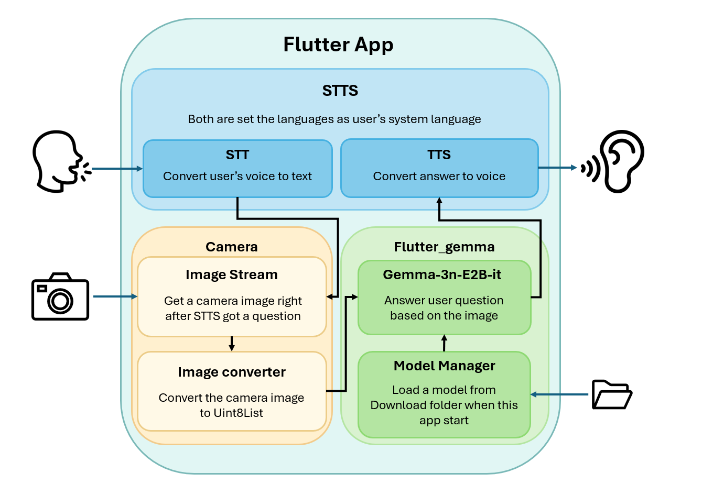

# 🌟 VAITech (VisionAITechnology)

VAITech is a Flutter-based mobile application that assists visually impaired users by describing their surroundings using Google’s Gemma-3n-E2B-it multimodal model. The app runs entirely offline and delivers real-time voice feedback through image and text input, providing an accessible and private AI assistant.

---

## 📺 Submission Video


---

## 🚀 Hackathon Entry

This app was built as an official entry to the Google Gemma-3n Hackathon. It utilizes the google/gemma-3n-E2B-it-litert-preview model via Google AI Edge runtime, deployed through .task format using the flutter_gemma plugin for fully offline multimodal inference.

---

## ✨ Features

✅ Offline on-device multimodal inference (image + text)

✅ Real-time voice assistant for the visually impaired

✅ Runs fully on mobile devices (Flutter Android supported)

✅ Uses Gemma-3n-E2B-it in .task format with flutter_gemma

✅ Supports native TTS (text-to-speech) and STT (speech-to-text) using system locale

✅ No internet required after deployment

---

## 🧠 Model Used (Google AI Edge)

This app uses:

[google/gemma-3n-E2B-it-litert-preview](https://huggingface.co/google/gemma-3n-E2B-it-litert-preview)

Optimized for .task format (LiteRT)

Runs on-device with [flutter_gemma plugin](https://pub.dev/packages/flutter_gemma)

---

## 🛠️ Getting Started

### 1. Clone the Repository

```bash
git clone https://github.com/wlsgusjjn/VAITech.git
cd VAITech
```

### 2. Install Flutter Packages

```bash
flutter pub get
```

### 3. Add .task Model File

Download the [.task file](https://huggingface.co/google/gemma-3n-E2B-it-litert-preview/blob/main/gemma-3n-E2B-it-int4.task) directly to your Android device’s Download folder.

Make sure the file name remains unchanged for the app to locate it correctly.


### 4. Run the App

```bash
flutter run -d android
```

---

## 🧪 Example Flow

1. User opens app.

2. Hears a voice prompt to ask a question.

3. Speaks a question (e.g., "What is in front of me?") after tap the screen.

4. App records audio, runs STT, captures a camera image.

5. The image + question text are sent to Gemma 3n.

6. Model response is read aloud using TTS.

---

## 🧩 Architecture Overview



- flutter_gemma loads .task model with LiteRT runtime

- record package for streaming audio input

- camera plugin for real-time image capture

- speech_to_text and flutter_tts for full voice interaction

---

## 🤖 Future Improvements

- Add native audio+image input once flutter_gemma supports direct audio

- Integrate Unsloth fine-tuned model once mmproj is supported in .gguf or .task

---

## 🤝 Contributions

This project is part of a Kaggle hackathon. Contributions and feedback are welcome!

---

## 📜 License

This project is licensed under the [MIT License](LICENSE).
